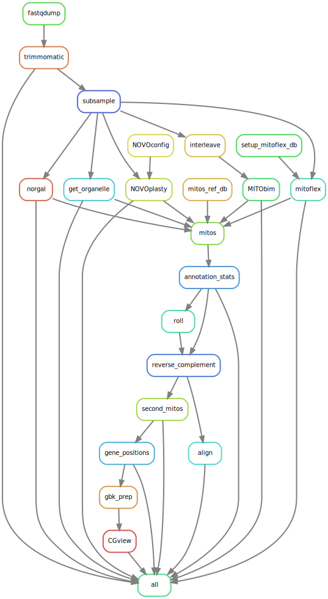

# MitoComp – A mitochondrial genome assembley, annotation and comparison pipeline.

The MitoComp pipeline is designed with two distinct aims. First, to provide a robust and user-friendly approach to assembling mitochondrial genomes from short-read WGS using five third-party, command-line based assembly tools. Second, MitoComp aims to provide an objective comparison of these assembly tools and how they work with different datasets. A rulegraph outlining the steps MitoComp takes is shown below.

WGS data is first provided by the user in one of two ways: i) by specifying the path to local reads in fastq.gz format or ii) providing the accession number of a short-read archive (SRA) of public data from genbank and downloading it in fastq.gz format using the fastqdump tool ([https://github.com/ncbi/sra-tools](https://github.com/ncbi/sra-tools)). MitoComp then trims ([https://github.com/timflutre/trimmomatic](https://github.com/timflutre/trimmomatic)) , subsamples ([https://github.com/lh3/seqtk](https://github.com/lh3/seqtk)), and interleaves ([https://github.com/BioInfoTools/BBMap](https://github.com/BioInfoTools/BBMap)) the datasets prior to assembling mitogenomes using:

- Mitoflex ([https://github.com/Prunoideae/MitoFlex](https://github.com/Prunoideae/MitoFlex))
- GetOrganelle ([https://github.com/Kinggerm/GetOrganelle](https://github.com/Kinggerm/GetOrganelle))
- NOVOplasty ([https://github.com/ndierckx/NOVOPlasty](https://github.com/ndierckx/NOVOPlasty))
- Norgal ([https://bitbucket.org/kosaidtu/norgal/src/master/](https://bitbucket.org/kosaidtu/norgal/src/master/))
- MITObim ([https://github.com/chrishah/MITObim](https://github.com/chrishah/MITObim))

The user may of course choose to use just one, all or any combination of these assemblers. Furthermore, the user may choose to the level to which the raw data are subsampled or instead choose to skip this step and use the entire dataset. The resulting assemblies are then annotated via MITOS ([https://gitlab.com/Bernt/MITOS](https://gitlab.com/Bernt/MITOS)) and aligned with one another for evaluation of inconsistencies between algorithms and A comparison with regards to speed, CPU usage, quality and annotation completeness is performed. MitoComp uses the pipeline management system Snakemake with all software tools containerized via Docker/Singularity.

## Obtaining and running MitoComp

MitoComp is primarily designed to run on HPC clusters using either a SGE or SLURM job scheduling system. It may also be run on a desktop computer using Linux but due to the computationally intensive nature of many of the steps involved, this is not optimal. Other than this MitoComp&#39;s only prerequisites are:

1. A singularity installation (tested with singularity version 3.5.2)
2. A snakemake installation (tested with snakemake 6.0.2; snakemake can be installed through conda using the following commands)

```
$ mamba create -c conda-forge -c bioconda -n snakemake snakemake
```
```
$ conda activate snakemake
```

The user should first clone this repository to their local computer. To do this use the following command.

```
$ git clone --recursive https://github.com/SamLMG/Assembly_pipeline_feb.git
```

## Setting up the analysis

The `data/data.tsv` file should be edited to correspond to the user&#39;s datasets. The columns in this file are named as follows:

```
ID	forward	reverse	seed	SRA	Clade	Code	novoplasty_kmer	Read_length	Adapter	Type	GO_Rounds
```

- ID: This column reverse to the name of the sample and may be freely completed by the user but we advise against the use of special characters including &quot;.&quot;
- forward, reverse: If the user wishes to provide their own WGS data, the paths to both forward and reverse reads should be provided in the corresponding columns. These reads should be in fastq format and gzipped.
- seed: For the assemeblers MITObim, NOVOplasty and GetOrganelle a seed sequence from the species in question is required. This may be any mitochondrial sequence but in most cases the coxI gene is used. The path to this seed should be specified in the seed column.
- SRA: MitComp can automatically download read data from NCBI SRA. Enter an SRA accession number here to do so.
- Clade: Some of the assemblers require the clade (e.g. phylum) of the chosen species which should be entered in the clade column.
- Code: Some of the assemblers and MITOS require the genetic code of the chosen species which should be entered in the clade column. A list of genetic codes may be found here [https://www.ncbi.nlm.nih.gov/Taxonomy/Utils/wprintgc.cgi?mode=c](https://www.ncbi.nlm.nih.gov/Taxonomy/Utils/wprintgc.cgi?mode=c)
- novoplasty_kmer: Novoplasty requires a k-mer length for assembly. Provide an uneven number here.
- Read_length: Length of the provided reads. This is used for trimming.
- Adapter: To perform adapter trimming, a relative path to a file with known adapter sequences should be provided here.
- Type: For novoplasty it is necessary to provide a database type here. Possible values are: 'embplant_pt', 'other_pt', 'embplant_mt', 'embplant_nr', 'animal_mt', 'fungus_mt', 'anonym', or a combination of above split by comma(s)
- GO_Rounds: XXX?

The user may also choose to edit the Snakefile. This allows different combinations of assemblers to be used by removing them from a list. By default, this is set to use all five assemblers:

```
Assembler = ["norgal", "getorganelle", "mitoflex", "novoplasty", "mitobim"]
```
The user may however, only want to use norgal, in which case they would set this to:

```
Assembler = ["norgal"]
```

Or they may wish to use both norgal and MITObim:

```
Assembler = ["norgal", "mitobim"]
```

Etc.

Furthermore, the level of subsampling can be set in the snakefile by editing the sub list.

For example, the following sub list will subsample the datasets thrice: with 5, 10 and 20 million randomly selected reads.

```
sub = [5000000, 10000000, 20000000]
```
The number of threads given to each rule can be set by the user by editing the data/config.yaml file. For instance,

```
threads:
   download: 2
   trimming: 24
```

will provide 2 threads for the download rule and 24 threads to the trimming rule.

Finally, we provide users working on a cluster with a template cluster config file for clusters using either a SLURM or a SGE submission system. Resources provided to each job as well as the paths to log files may be set here by the user according to their cluster settings.

The following command uses the assembly script to run the pipeline on a SLURM system:

```
$ ./assembly -t slurm -c data/cluster-config-SLURM.yaml.template
```

Or on an SGE system:

```
$ ./assembly -t sge -c data/cluster-config-SGE.yaml.template
```

We advise adding the `--dry` option to this command first. This will not submit any jobs but will print jobs to be completed and flag up any errors.

A rulegraph showing the order in which jobs will run is shown below:


